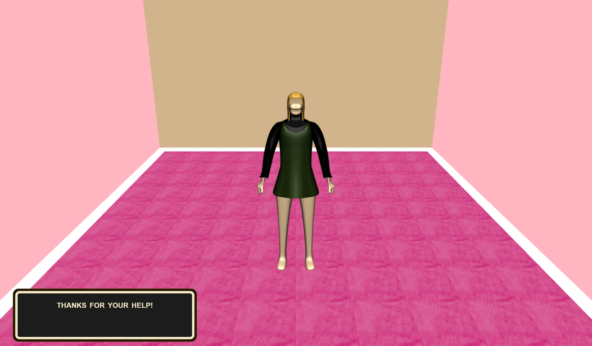

# CompGraphicsFinalProject

A fun dress up game!

For my final project, I made a dress up game using Three.JS. This is a clickable storyline game.

To play, the user must be able to run projects through localhost. 

Upon opening file, a user can now click through until the model asks for a texture to be chosen.

A player can click between the left or right arrow. One texture gets the models approval, the other does not.

Either way the game finishes with the model thanking the player!

